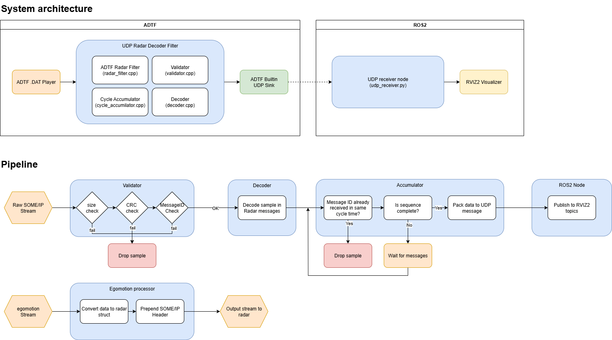

# Assignment 1 - ADTF Plugin

The aim of the project was to build an ADTF pluging that would decode a raw stream from a radar and visualize the scans in a point cloud.
Our approach to the task include an ADTF filter that receives the stream as input, decodes the messages and provides the decoded information to the visualizer via UDP stream on localhost. The visualizer has been chosen to be Rviz2 over ROS2, as the built-in display toolbox in ADTF has reached EOL. A custom package for ROS2 has been developed as a bridge between the UDP stream and the topic-based architecture of ROS2.

> [!info]
> All the code was developed and build on Linux x86_64 system with g++ and CMake. Some compiler-specific methods were used for byte swapping, you may need to change them if compiling on different platforms. Cross-platform binary are delivered on th "delivery" folder.

-----

## Architecture



-----

## Repository Structure

```
MikeWazowski/
├── assets/              # UML diagrams and documentation assets
├── assignment/          # Files provided (RadarTypes.h and EgoMaster3DOutput.h)
├── radar_decoder/       # Shared library: packet decoding logic
├── radar_filter/        # ADTF filter plugin: reads radar input pins, decodes packets
├── udp_sender/          # ADTF filter plugin: forwards data over UDP
├── ros2_ws/             # ROS 2 workspace containing the udp_receiver package and launch file
├── delivery/            # Compiled binary files for ADTF plugin
└── CMakeLists.txt       # Top-level CMake for ADTF plugins
```

-----

## Prerequisites

- **ADTF** with `ADTF_sdk` and `adtffiltersdk` CMake packages (**ADTF 3.23** was used)
- **CMake ≥ 3.18**
- **ROS 2** (Humble or later) with `colcon`
- **RViz2**

-----

## Building the C++ / ADTF Plugins

The top-level `CMakeLists.txt` builds `radar_decoder`, `radar_filter`, and `udp_sender` as ADTF filter plugins.

```bash
# Create a build directory
mkdir build && cd build

# Configure — point CMake at your ADTF installation if needed
cmake .. -DADTF_DIR=/path/to/adtf/cmake

# Build all three plugins
cmake --build . --parallel
```

The resulting `.adtfplugin` (or shared library) files will be placed in the build output directory. Put them in the ADTF_DIR/bin directory to make them available in your ADTF configuration.

-----

## Building the ROS 2 `udp_receiver` Package

```bash
# Navigate into the ROS 2 workspace
cd ros2_ws

# Install ROS dependencies
rosdep install --from-paths src --ignore-src -r -y

# Build with colcon
colcon build 

# Source the workspace overlay
source install/setup.bash
```

-----

## Launching the ROS 2 Node

After sourcing the workspace, launch the `udp_receiver` node via the launcher provided in the ros2_ws/launch directory:

```bash
ros2 launch launch radar.launch.py
```

The launch file also handles the static TFs between map, base_link (vehicle) and radar_link (radar mount).


The node listens on the configured UDP port and publishes radar detections as `sensor_msgs/PointCloud2` topics (e.g. `/radar/near` and `/radar/far`). The default UDP port is set to 5000.

-----

## Launching RViz2

```bash
ros2 run rviz2 rviz2
```

In RViz2, open the configuration delivered in ros2_ws/rviz_config/

-----

## ADTF Configuration

### Step-by-step Setup

#### 1. Load the Plugins

Move the compiled binaries from delivery/ to your ADTF_DIR/bin directory.

#### 2. Add the blocks

1. In the **Filter Graph**, add a new **ADTF Player** source, the custom **UDP Radar Decoder** filter and the builtin **UDP Sender to Non-ADTF Applications** sink.
1. Set the **File** property to your radar recording (`.adtfdat`).
1. Configure the UDP sink host and port to `localhost` and `5000`.
1. Connect the `radar_data_udp` pin of the Player to the `raw_someip` input pin of the custom filter. 
1. Connect the `udp_out` output pin of the custom filter to the `input` pin of the UDP sink.
1. If you need it, you can use `egomotio_input` input pin and `vehicle_dynamics` output pin to parse information about the vehicle motion to the radar via SOME/IP.

> [!info] 
> The other output pins of the custom filter are currently not populated, but they was developed for modularity.

#### 3. Run

Run ADTF pressing **F5** in the ADTF Configuration Editor. The pipeline will replay the recording, filter the radar data, and stream it via UDP to the ROS 2 node.

## Visualizer

You should now see the points in the RViz2 visualizer. In there, you will see red colored points for near mode scans and green colored points for far mode scans. You can activate and deactivate the visualization by unchecking the boxes on the left toolbar.

